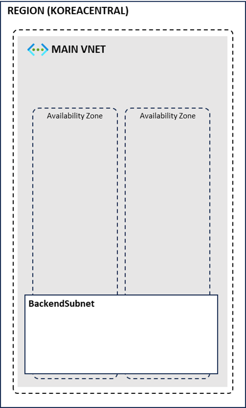

# Network Resource Deploy

## 리소스 그룹 생성

1. 리소스 그룹 메뉴로 이동합니다.
2. 왼쪽 상단 만들기 버튼을 클릭합니다.
3. 리소스 그룹 이름에 `securityworkshop-<alias>-rg` 를 입력하고 영역에 `(Asia Pacific) Korea Central`을 선택합니다.
4. 검토+만들기 버튼을 클릭 후, 만들기 버튼을 클릭합니다.

## 가상 네트워크 생성

### 메인 네트워크 생성

1. 가상 네트워크 메뉴로 이동합니다.
2. 왼쪽 상단 만들기 버튼을 클릭합니다.
3. 다음과 같이 설정 후 다음 버튼을 2번 클릭합니다.
    - 구독 : 생성한 구독 선택
    - 리소스 그룹 : securityworkshop-<alias>-rg
    - 가상 네트워크 이름 : main-vnet
    - 지역 : (Asia Pacific) Korea Central
4. IP 주소 탭에서 CIDR 공간을 지정합니다.
    - 가상 네트워크 CIDR : 10.0.0.0/16
    - default 서브넷의 연필 모양 아이콘을 클릭하여 서브넷을 수정합니다.
        - 서브넷 이름 : backend-subnet
5. 검토+만들기 버튼을 클릭하고 만들기 버튼을 클릭합니다.