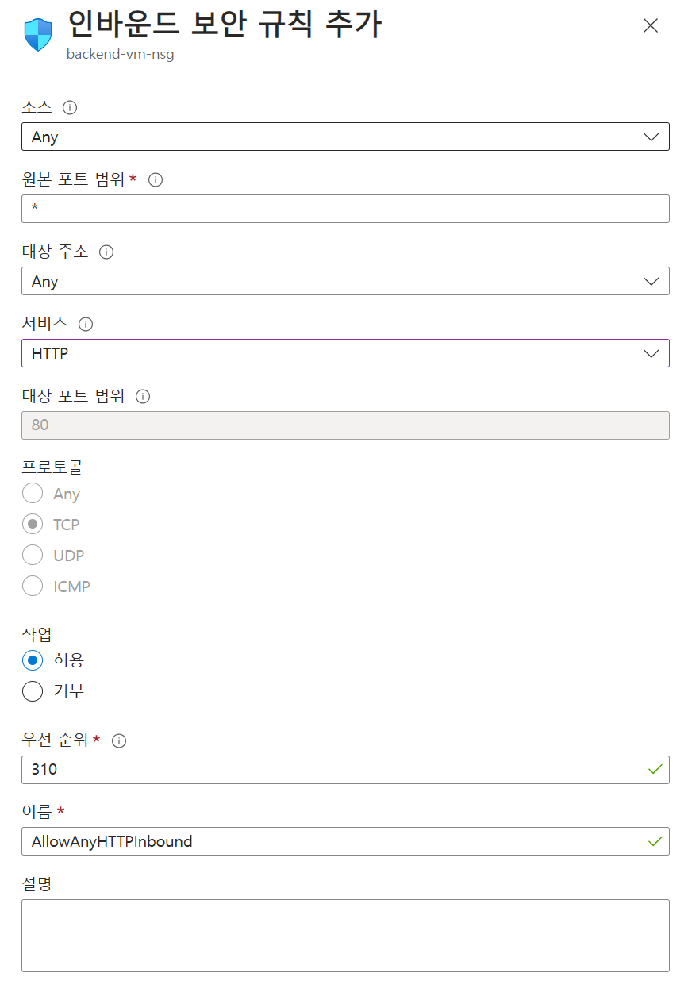

# Test Resource Deploy

## 가상 머신 생성

1. 가상 머신 화면으로 이동합니다.
2. 왼쪽 상단의 만들기 버튼을 클릭하고 Azure 가상 머신을 선택합니다.
3. 아래와 같이 설정합니다.
    - 구독 : 생성한 구독 선택
    - 리소스 그룹 : securityworkshop-<alias>-rg
    - 가상 머신 이름 : backend-vm
    - 가용성 옵션 : 인프라 중복이 필요하지 않습니다.
    - 보안 유형 : 표준
    - 이미지 : Ubuntu Server 20.04 LTS - x64 Gen2
4. 다음: 디스크 > 버튼을 클릭합니다.
5. 다음: 네트워킹 > 버튼을 클릭합니다.
6. 네트워킹 탭에서 아래와 같이 설정합니다.
    - 가상 네트워크 : main-vnet
    - 서브넷 : backend-subnet
    - 공용 IP : 생성
7. 검토 + 만들기 버튼을 클릭하여 가상 머신을 생성합니다.

## 샘플 애플리케이션 구성

1. 아래 명령어를 이용하여 가상 머신에 접속합니다.

```bash
ssh -i backend-vm_key.pem azureuser@<VM 공용 아이피>
```

1. 아래 명령어를 사용하여 도커 컨테이너를 설치합니다.

```bash
sudo apt update
sudo apt install docker.io
```

1. 아래 명령어를 사용하여 애플리케이션을 띄웁니다.

```bash
sudo docker container run -d --name juice_shop --rm -p 80:3000 bkimminich/juice-shop
```

### 네트워크 설정

1. 생성한 가상 머신 화면으로 이동합니다.
2. 왼쪽 메뉴에서 네트워크 설정을 클릭합니다.
3. 아래 규칙에서 포트 규칙 만들기 버튼을 클릭하고 인바운드 포트 규칙을 클릭합니다.
4. 다음과 같이 구성 후 추가 버튼을 클릭합니다.
    
    