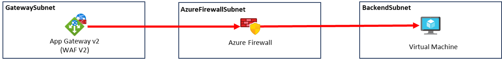

# Network Connectivity

## Application Gateway 백엔드 풀 설정

1. 애플리케이션 게이트웨이 메뉴로 이동합니다.
2. 생성한 `appGW`를 클릭합니다.
3. 왼쪽 메뉴에서 백 엔드 풀을 선택합니다.
4. `backend-pool`을 클릭합니다.
5. 대상 유형에서 가상 머신을 클릭하고  생성한 `backend-vm`의 프라이빗 IP를 입력합니다.
6. 저장 버튼을 클릭합니다.

## 방화벽 규칙 구성

다음 정보를 기록합니다.

- hub-vnet/appgw-subnet의 CIDR
- spoke-vnet/app-subnet의 CIDR
- 방화벽의 개인 IP

1. 방화벽 메뉴로 이동합니다.
2. 생성한 `default-firewall`을 클릭합니다.
3. 개요 하단에 Firewall policy에서 생성한 `default-fw-policy`를 클릭합니다.
4. 왼쪽 메뉴에서 네트워크 규칙을 선택합니다.
5. 규칙 컬렉션 추가 버튼을 클릭하고 아래 두 개의 규칙을 구성합니다.

### AppGW-to-Backend Rule

- 이름 : app-rules
- 규칙 컬렉션 형식 : 네트워크
- 우선 순위 : 1000
- 규칙 컬렉션 작업 : 허용
- 규칙 컬렉션 그룹 : DefaultNetworkRuleCollectionGroup
- 규칙
    - 이름 : AppGW-to-Backend
    - 원본 : <appgw-subnet의 CIDR>
    - 프로토콜 : 모두
    - 대상 포트 : *
    - 대상 유형 : IP 주소
    - 대상 : <app-subnet의 CIDR>

> 규칙이 추가된 후, 다음 작업을 진행해야 합니다.
> 

### Backend-to-AppGW Rule

- 이름 : appgw-rules
- 규칙 컬렉션 형식 : 네트워크
- 우선 순위 : 1001
- 규칙 컬렉션 작업 : 허용
- 규칙 컬렉션 그룹 : DefaultNetworkRuleCollectionGroup
- 규칙
    - 이름 : Backend-to-AppGW
    - 원본 : <app-subnet의 CIDR>
    - 프로토콜 : 모두
    - 대상 포트 : *
    - 대상 유형 : IP 주소
    - 대상 : <appgw-subnet의 CIDR>
    

## 경로 테이블 구성

1. 경로 테이블 메뉴로 이동합니다.
2. 아래 두 개의 경로 테이블을 구성합니다.

### app-udr

1. 만들기 버튼을 클릭합니다.
2. 다음과 같이 구성 후 검토 + 만들기, 만들기 버튼을 클릭합니다.
    - 구독 : 생성한 구독
    - 리소스 그룹 : securityworkshop-<alias>-rg
    - 지역 : Korea Central
    - 이름 : app-udr
    - 게이트웨이 경로 전파 : Yes
3. 생성된 경로 테이블 화면으로 이동합니다.
4. 왼쪽 메뉴에서 경로를 선택합니다.
5. 추가 버튼을 클릭합니다.
6. 다음과 같이 구성 후, 추가 버튼을 클릭합니다.
    - 경로 이름 : firewall
    - 대상 유형 : IP 주소
    - 대상 IP주소/CIDR 범위 : <appgw-subnet의 CIDR>
    - 다음 홉 형식 : 가상 어플라이언스
    - 다음 홉 주소 : <방화벽의 개인 IP>
7. 왼쪽 메뉴에서 서브넷을 선택합니다.
8. 연결 버튼을 클릭합니다.
9. 서브넷 연결에서 가상 네트워크를 `main-vnet`, 서브넷을 `app-subnet`으로 선택하고 확인 버튼을 클릭합니다.

### appgw-udr

1. 만들기 버튼을 클릭합니다.
2. 다음과 같이 구성 후 검토 + 만들기, 만들기 버튼을 클릭합니다.
    - 구독 : 생성한 구독
    - 리소스 그룹 : securityworkshop-<alias>-rg
    - 지역 : Korea Central
    - 이름 : appgw-udr
    - 게이트웨이 경로 전파 : Yes
3. 생성된 경로 테이블 화면으로 이동합니다.
4. 왼쪽 메뉴에서 경로를 선택합니다.
5. 추가 버튼을 클릭합니다.
6. 다음과 같이 구성 후, 추가 버튼을 클릭합니다.
    - 경로 이름 : to-firewall
    - 대상 유형 : IP 주소
    - 대상 IP주소/CIDR 범위 : <app-subnet의 CIDR>
    - 다음 홉 형식 : 가상 어플라이언스
    - 다음 홉 주소 : <방화벽의 개인 IP>
7. 왼쪽 메뉴에서 서브넷을 선택합니다.
8. 연결 버튼을 클릭합니다.
9. 서브넷 연결에서 가상 네트워크를 `main-vnet`, 서브넷을 `appgw-subnet`으로 선택하고 확인 버튼을 클릭합니다.